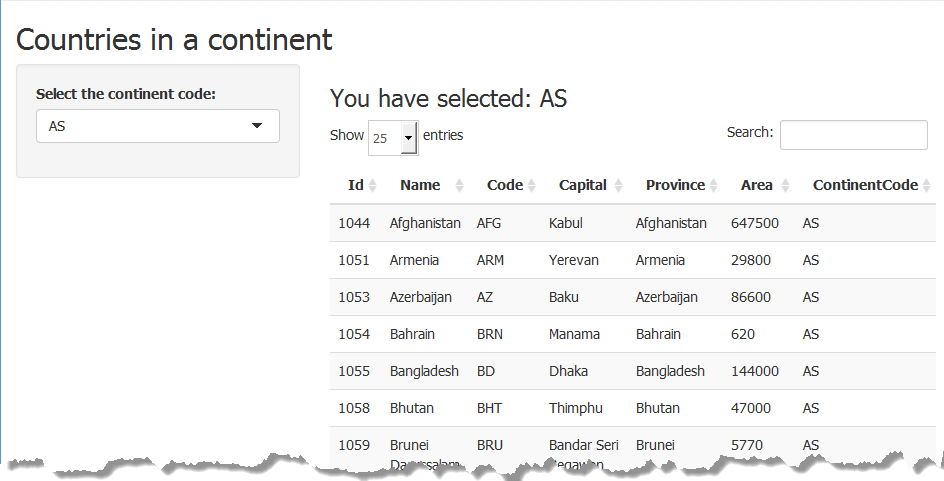

## Description of my Shiny Application

The purpose of this application is to allow the user explore the countries data for a given continent.

- The user selects the continent he/she wants to display.
  This can be one of the following:
  - AS = ASIA, 
  - AF = AFRICA, 
  - EU = EUROPE, 
  - OC = OCEANIA, 
  - NA = NORTH AMERICA, 
  - SA = SOUTH AMERICA. 
      
- An data grid is displayed for the selected continent code  
- The data display is paged and the user can navigate over the pages 


--- .class #id 

## ui.R Code

This is the user interface part of my shiny app:


```r
library(shiny)

# Define UI for the application 
shinyUI(fluidPage(
  # Application title
  titlePanel("Contries in a continent"),
  
  # Sidebar with controls to select the continent code to display
  sidebarLayout(
    sidebarPanel(
      selectInput("dataIndex", "Select the continent code:", 
                  c("AS","EU","AF","NA","SA","OC"))),
    
      # Show the coutries list
    mainPanel(
      h3(textOutput("dataIndex")),
      dataTableOutput("countryContinents")
    )
  )
))
```

--- .class #id 

## server.R Code

This is the server part of my shiny app:


```r
library(shiny)
# Load the couties dataset
countries <- read.csv("Countries.csv", na.strings=c(""))


shinyServer(
  function(input, output) {
    
    # display the user choice
    output$dataIndex <- renderText({  
      paste("You have selected:",input$dataIndex)
    })  
    # return the data subset related to the user choice
    output$countryContinents <- renderDataTable({  
     countries[countries$ContinentCode == input$dataIndex , ] 
     })  
})
```

--- .class #id 

## Shiny app screenshot
 




